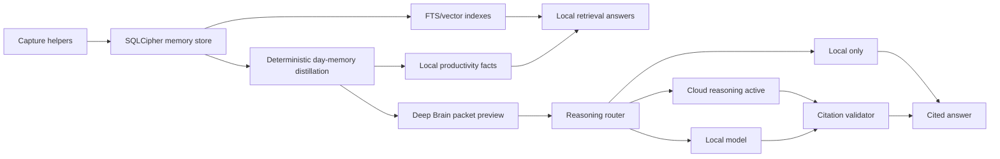

# Deep Brain Model Strategy

**Status:** Draft architecture decision, researched on 2026-06-27.

## Decision

OpenBird should not depend on the current on-device model route to satisfy the
whole second-brain product promise.

The durable architecture is hybrid:

- Local systems are the source of truth, privacy boundary, and default answer
  path.
- Local or on-device models can help with bounded transformations over already
  distilled memory when they are available and truthful.
- Frontier reasoning is optional, user-triggered, and routed only over explicit
  Deep Brain packets: distilled day/week memory plus selected cited snippets,
  never the raw database.

This keeps the product honest. A solopreneur should be able to ask "what did I
leave unfinished last Thursday?" locally, but the higher-order coaching and
longitudinal synthesis that make the product feel like a second brain should be
allowed to use a stronger model when the user opts in.

## Research Summary

Current vendor direction supports the hybrid design:

- Apple describes Private Cloud Compute as the privacy-preserving cloud path for
  Apple Intelligence requests that are more complex than on-device models can
  handle. Apple also announced developer access to a server model through the
  Foundation Models framework, with larger context and more complex reasoning
  than the on-device model.
- OpenAI, Anthropic, and Google all expose frontier cloud models with large
  context windows and reasoning/tool-use features aimed at complex work. These
  are a better fit for longitudinal synthesis, planning, and nuanced coaching
  than today's default local route.
- Local models are improving quickly. Gemma 4 is explicitly optimized for
  on-device use and advertises 128K to 256K context depending on model size.
  Ollama now exposes context defaults based on available VRAM, and Apple MLX
  makes local inference practical on Apple silicon.
- Large context is not a substitute for memory architecture. Anthropic's context
  management docs call context a finite resource that needs curation, and local
  long-context inference still has meaningful memory and latency costs.

The implication for OpenBird is: keep raw memory local, distill it aggressively,
and send only the smallest cited packet needed for the user's explicit question.

## Architecture

The packet boundary is load-bearing. Anything past `packet` is allowed to reason
only over the packet object, not over SQLite, raw observations, full window
titles, raw URLs, or unbounded screenshot/application text.

## Route Policy

### Local Always

These paths must work without cloud opt-in and without constructing a remote
provider:

- capture allowlists, pauses, and dangerous-app blocks
- SQLCipher storage and derived local indexes
- purge, prune, integrity, stats, and export safety checks
- app/category/session timelines
- deterministic productivity facts
- day-memory distillation
- Deep Brain packet preview
- deterministic day-scoped Ask answers over day memory

These paths should use `reasoning_route=local_deterministic` where they answer a
question directly, and the user-facing label should stay "Local only." For Ask,
the explicit day-scoped path should return before constructing a cloud/embedding
provider; query-inferred day answers may construct a provider object but must
return before any completion or embedding request.

### Local Model

A model-backed answer may still be local when the resolved model destination is
loopback or on-device. The route label must be resolved from the model
destination, not from the feature that triggered the call.

Use local models for bounded work:

- rewriting a short distilled summary
- extracting structured fields from a day-memory packet
- answering over a single day/week packet when citations validate
- quick, low-risk coaching drafts that cite local fact IDs

Do not use local models as the only long-horizon memory layer. They are a useful
execution option, not the product's source of truth.

### Cloud Reasoning Active

Deep Brain ask, productivity coaching, and model-written briefings are
cloud-capable triggers, not inherently cloud routes.

The route becomes `cloud_reasoning_active` only when the resolved model is remote
or non-loopback. In that case:

- `OPENBIRD_ALLOW_CLOUD` is required.
- The UI/CLI must disclose "Cloud reasoning active."
- The request body must be built from the same packet preview surface the user
  can inspect.
- Per-app, per-source, and per-observation exclusions must apply before packet
  construction.
- The answer must cite packet source IDs, and uncited claims must be refused or
  marked as ungrounded.
- Local deletion cannot recall payloads already sent to a remote provider, so
  cloud sends should be auditable.

Feature gates are separate from remote egress:

- Deep Brain ask and productivity coaching require the Deep Brain feature gate.
- Model-written briefing uses the explicit `--model` flag as its feature opt-in.
- Any remote model path still requires `OPENBIRD_ALLOW_CLOUD`.

## Provider Strategy

Keep BYOK provider support provider-agnostic through the existing LiteLLM-style
route abstraction, but expose the resolved route truthfully:

| Provider family | Role in OpenBird | Privacy posture |
|---|---|---|
| Ollama loopback / local MLX | Ollama loopback is the wired default local model option for bounded work; local MLX is reserved, not yet wired | Local if host is loopback/on-device |
| OpenAI | Optional frontier reasoning and coding-quality synthesis | Third-party cloud, BYOK, explicit opt-in |
| Anthropic | Optional long-context reasoning and critique | Third-party cloud, BYOK, explicit opt-in |
| Gemini | Optional long-context multimodal/reasoning route | Third-party cloud, BYOK, explicit opt-in |
| Apple Foundation Models | Local model adapter when available | Local/on-device when the framework routes locally |
| Apple PCC through Foundation Models | Future provider candidate | Cloud egress, but potentially stronger privacy properties if the API surface and availability are verifiable |

Apple PCC should not be promised as an OpenBird route until the implementation
can prove availability, account limits, failure modes, and user-visible route
truth on macOS. It belongs behind the same packet boundary as every other remote
reasoning path.

## Why Not Local Only

Local-only remains the default privacy story, but it is not enough for the full
second-brain promise:

- Longitudinal synthesis across weeks or months needs stronger planning and
  abstraction than deterministic metrics alone.
- Local long-context inference can be memory-heavy and slow, especially on Macs
  below high unified-memory tiers.
- Stuffing raw history into any model, local or cloud, creates quality and
  privacy problems. Distillation and citation selection are required either way.
- A second brain must answer "why" and "what should I do next?" without making
  unverifiable claims. That requires citation validation and, sometimes, a
  stronger model.

The product should therefore be local-first, not local-only.

## Implementation Backlog

1. Persistent GUI opt-in for remote reasoning, wired to the subprocess
   environment and visible in preflight.
2. Provider picker with BYOK labels, resolved destination, and route preview.
3. Deep Brain send ledger: timestamp, provider family, route class, packet hash,
   excluded counts, citation IDs, and deletion caveat. Never store raw packet
   text in the ledger.
4. Per-app/source/observation exclusion UI for packet construction.
5. Packet preview in the app before first cloud send.
6. Citation validator hardening: every coaching claim must map to session,
   source, or productivity-fact IDs.
7. Local-vs-cloud eval set for common second-brain questions:
   "what did I leave off?", "what changed this week?", "when am I productive?",
   and "what should I fix tomorrow?"
8. Optional Apple Foundation Models adapter only after route availability,
   privacy state, and fallback behavior can be tested on a real macOS build.

## Sources

- Apple Security Research, "Private Cloud Compute: A new frontier for AI privacy
  in the cloud": https://security.apple.com/blog/private-cloud-compute/
- Apple Security Research, "Expanding Private Cloud Compute":
  https://security.apple.com/blog/expanding-pcc/
- Apple Developer, "Build with the new Apple Foundation Model on Private Cloud
  Compute": https://developer.apple.com/videos/play/wwdc2026/319/
- OpenAI API model docs: https://developers.openai.com/api/docs/models
- Anthropic Claude context windows docs:
  https://platform.claude.com/docs/en/build-with-claude/context-windows
- Anthropic context editing docs:
  https://platform.claude.com/docs/en/build-with-claude/context-editing
- Google Gemini long context docs:
  https://ai.google.dev/gemini-api/docs/long-context
- Google Gemma 4 model overview: https://ai.google.dev/gemma/docs/core
- Ollama context length docs: https://docs.ollama.com/context-length
- Apple MLX open source project: https://opensource.apple.com/projects/mlx
